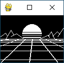

# Outrun - synthwave/retrowave/vaporwave digital art

Retro video games, futuristic design, rave music, 80s computer graphics and
sci-fi particular aesthetic concept written on pygame engine.
Created as a layout for porting to the microcontroller.

-   Size: 128x96px (scale)
-   Primitives: line, circle, rect.
-   Colors: black and white.
-   Animation: grid mesh - forward and sideways movement.

## Preview



## Installation and running

```
python -m venv env
source env/bin/activate
pip install -r requirements.txt
python main.py
```

> Activate virtual environment (second step) on Windows:
>
> ```
> .\env\Scripts\activate
> ```

## Credits

-   Di M Dub
